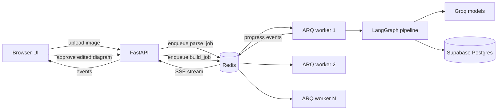
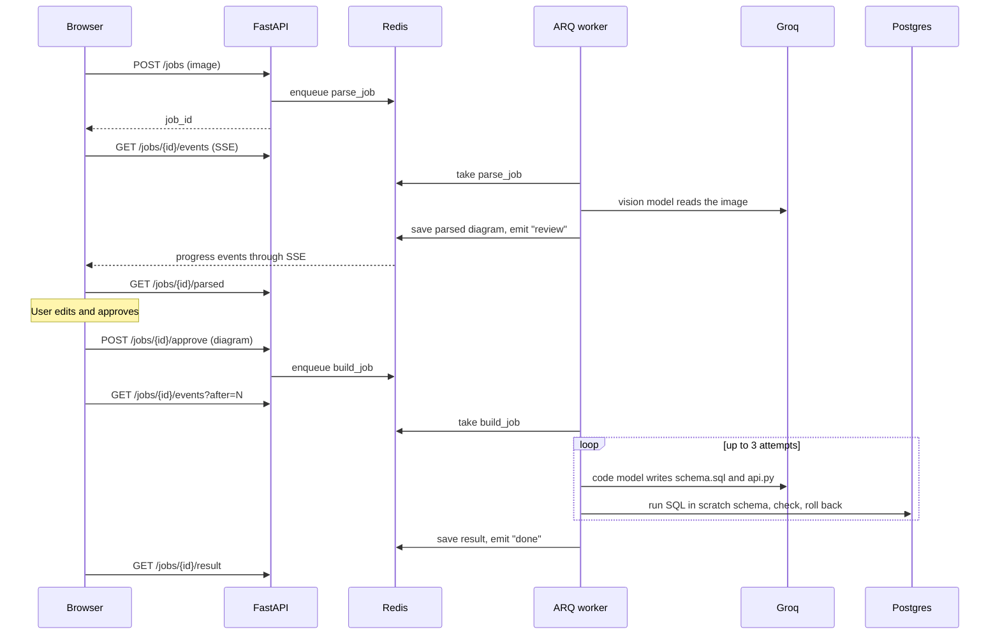
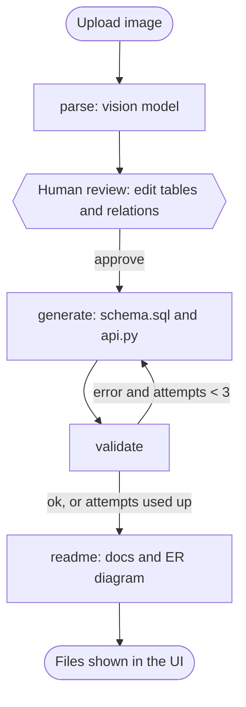

# Whiteboard to Code

Upload a photo of a hand-drawn ER diagram. A vision model reads it, **you review and correct what it read**, and the project returns a **validated PostgreSQL schema**, a **FastAPI skeleton** and a **README with a rendered ER diagram**.

It is also a hands-on exploration of **LangGraph agent pipelines running behind a Redis job queue**, with several workers, live progress over SSE and a human-in-the-loop step.

## Contents

- [What it does](#what-it-does)
- [Why it is useful](#why-it-is-useful)
- [Architecture](#architecture)
- [How a job flows](#how-a-job-flows)
- [The LangGraph pipeline](#the-langgraph-pipeline)
- [Human review step](#human-review-step)
- [How the SQL is validated](#how-the-sql-is-validated)
- [Why a Redis queue](#why-a-redis-queue)
- [Tech stack](#tech-stack)
- [Project structure](#project-structure)
- [Setup](#setup)
- [Run](#run)
- [API](#api)
- [Configuration](#configuration)

## What it does

1. You upload a photo or screenshot of an ER diagram (JPEG, PNG or WebP, up to 8 MB).
2. The image is straightened and its contrast is boosted, then a **vision model** extracts tables, columns and relations.
3. The pipeline **pauses for review**. You fix misread names, types, keys and relations in an editable form, then approve.
4. A **code model** writes `schema.sql` and `api.py` from the approved diagram.
5. The SQL is **executed for real** in a throwaway Postgres schema, and the resulting tables are compared with your diagram. If anything fails, the error goes back to the model, up to 3 attempts.
6. A README with a Mermaid ER diagram is generated.
7. Every step streams live to the browser. The results are shown in tabs with copy and download buttons.

## Why it is useful

- Turns a whiteboard or notebook sketch into a starting schema in about a minute, which helps students, hackathon teams and early design discussions.
- The review step means a misread handwriting mistake does not silently turn into wrong code.
- The validation loop means the SQL you receive has already run, and matches the tables you drew.
- It works as a compact reference for putting LangGraph behind a queue with multiple workers and live progress.

## Architecture



Redis holds four kinds of data per job, all expiring after 24 hours:

| Key | Content |
|---|---|
| `job:{id}:events` | Progress events (a list the browser reads with a cursor) |
| `job:{id}:parsed` | The diagram extracted by the vision model |
| `job:{id}:approved` | A flag that stops a job from being approved twice |
| `job:{id}:result` | The generated files and any remaining errors |

## How a job flows



The two phases are separate queue jobs, so they can run on different workers.

## The LangGraph pipeline



`app/graph.py` defines two compiled graphs that share the same nodes:

- `parse_graph`: `parse` only. The worker stores the result and emits `review`.
- `build_graph`: `generate`, `validate`, then `readme`, with the retry loop between the first two.

There is also a combined `graph` used by `run_cli.py` to run everything without the queue or review.

The review pause is implemented as two queue jobs rather than LangGraph's `interrupt()`. `interrupt()` needs a checkpoint store shared by all workers, and this approach gives the same user experience with fewer moving parts.

## Human review step

After the vision model reads the diagram, the page shows an editor:

- rename tables, add or remove tables
- edit column names and PostgreSQL types, toggle primary keys, add or remove columns
- change relation endpoints, type (`one-to-one`, `one-to-many`, `many-to-many`) and label
- read the model's own notes about anything it was unsure of

Approving sends the edited diagram to `POST /jobs/{id}/approve`, which queues the build phase. The server validates the payload and refuses a second approval of the same job.

## How the SQL is validated

Validation runs inside one database transaction that is **always rolled back**, so nothing is ever kept in your database.

1. A uniquely named scratch schema is created, so parallel jobs never collide.
2. `schema.sql` is executed. Any Postgres error is sent back to the model.
3. The tables Postgres actually created are compared with the approved diagram:
   - every entity has a table
   - every column in the diagram exists in that table
   - one-to-one and one-to-many relations have a foreign key between the two tables
   - every many-to-many relation has its own junction table
4. `api.py` is syntax-checked.
5. Failures become the next attempt's instructions, up to 3 attempts.

Connection problems stop the job immediately, because the model cannot fix them.

The comparison is intentionally lenient about naming and about which side of a one-to-many holds the foreign key, so a harmless rename such as `character` to `game_character` is not rejected.

## Why a Redis queue

LLM calls are slow and rate limited. Running them inside the HTTP request would block the server and make it easy to burn through free-tier limits.

- The API accepts an upload and returns a job id right away.
- Any number of workers pull from the same queue. Each job runs on exactly one worker.
- `max_jobs` limits how many jobs one worker runs at once, which doubles as a simple rate limiter.
- Workers write progress events to a Redis list. The API streams them over Server-Sent Events, and the browser tracks how many events it has seen, so it can reconnect after the review step without replaying old events.
- Each event carries the worker's process id, so the UI log shows which worker handled each stage.

To see parallelism, start three workers in three terminals and submit several diagrams at once. Extra jobs wait in the queue until a worker frees up.

## Tech stack

| Part | Tool |
|---|---|
| Agent orchestration | LangGraph, LangChain |
| Vision model | `qwen/qwen3.8-27b` on Groq |
| Code model | `openai/gpt-oss-120b` on Groq |
| API | FastAPI, Server-Sent Events (`sse-starlette`) |
| Queue | Redis (Memurai on Windows) with ARQ |
| Database | Supabase Postgres, used as a validation sandbox |
| Image handling | Pillow (rotation fix, grayscale, auto-contrast, resize) |
| Frontend | Plain HTML, CSS and JavaScript, Mermaid for the diagram |

Everything runs on free tiers. No GPU and no Docker are needed. Groq's model lineup changes often, so model names live in `.env`.

## Project structure

```
app/
  main.py          FastAPI app: upload, SSE events, review, approve, results, serves the UI
  graph.py         LangGraph definitions and retry routing
  state.py         Graph state
  schemas.py       Pydantic models for the parsed diagram
  config.py        Environment configuration
  nodes/
    vision.py      Prepares the image and reads the diagram
    generate.py    Writes schema.sql and api.py
    validate.py    Scratch-schema run, fidelity checks, rollback
    readme.py      Builds README and Mermaid diagram (no LLM)
worker/
  tasks.py         ARQ jobs: parse_job and build_job
templates/
  index.html       The web UI
run_cli.py         Run the whole pipeline once, without the queue or review
requirements.txt
.env.example
```

## Setup

You need Python 3.11 or 3.12, a Redis server, a free [Groq](https://console.groq.com/keys) API key and a free [Supabase](https://supabase.com) project.

1. **Redis.** On Windows install [Memurai Developer](https://www.memurai.com). On Linux or macOS install Redis. It should listen on `127.0.0.1:6379`.
2. **Supabase.** Create a project and copy the **Session pooler** connection string from the Connect dialog. No extensions are needed.
3. **Clone and create the environment.**

```powershell
git clone https://github.com/<your-username>/<repo-name>.git
cd <repo-name>
python -m venv .venv
.venv\Scripts\Activate.ps1
pip install -r requirements.txt
```

On Linux or macOS, activate with `source .venv/bin/activate`.

4. **Create `.env`** from `.env.example` and fill it in:

```
GROQ_API_KEY=
SUPABASE_DB_URL=
REDIS_URL=redis://127.0.0.1:6379
VISION_MODEL=qwen/qwen3.8-27b
CODE_MODEL=openai/gpt-oss-120b
```

If your database password contains special characters, percent-encode them in the URL (`@` becomes `%40`).

## Run

Open separate terminals in the project root, each with the virtual environment active.

```powershell
# Terminal 1: API and UI
uvicorn app.main:app --reload

# Terminals 2, 3, 4: workers (one is enough, more shows parallelism)
arq worker.tasks.WorkerSettings
```

Open http://127.0.0.1:8000/, upload a diagram, review the extracted tables, approve, and watch the pipeline run.

Workers do not reload automatically. Restart them after changing code.

To run the pipeline once without the queue and without the review step:

```powershell
python run_cli.py path\to\diagram.jpg
```

## API

| Method | Path | Purpose |
|---|---|---|
| GET | `/` | The web UI |
| POST | `/jobs` | Upload an image, returns `{ "job_id": "..." }` |
| GET | `/jobs/{id}/events?after=N` | SSE stream of progress, starting after event N |
| GET | `/jobs/{id}/parsed` | The diagram extracted by the vision model |
| POST | `/jobs/{id}/approve` | Send the reviewed diagram, starts the build phase |
| GET | `/jobs/{id}/result` | Generated files, remaining errors, approved diagram |
| GET | `/docs` | Interactive Swagger UI |

Stages in the event stream: `started`, `parse`, `review`, `generate`, `validate`, `readme`, `done`, `failed`. The stream closes at `review`, `done` and `failed`.

## Configuration

| Setting | Where | Default |
|---|---|---|
| `GROQ_API_KEY` | `.env` | required |
| `SUPABASE_DB_URL` | `.env` | required |
| `REDIS_URL` | `.env` | `redis://localhost:6379` |
| `VISION_MODEL` | `.env` | `qwen/qwen3.8-27b` |
| `CODE_MODEL` | `.env` | `openai/gpt-oss-120b` |
| Jobs per worker | `max_jobs` in `worker/tasks.py` | 1 |
| Fix attempts | `MAX_ATTEMPTS` in `app/graph.py` and `templates/index.html` | 3 |
| Data retention in Redis | `TTL` in `worker/tasks.py` | 24 hours |
| Maximum image size | `MAX_BYTES` in `app/main.py` | 8 MB |
