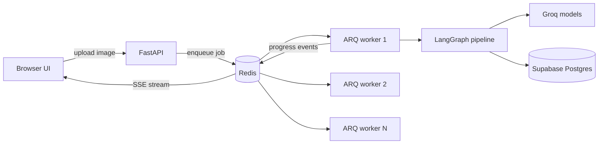
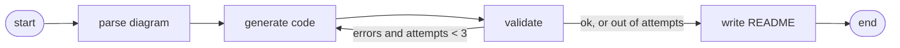

# Whiteboard to Code

Upload a photo of a hand-drawn ER diagram and get back a **validated PostgreSQL schema**, a **FastAPI skeleton** and a **README with a rendered ER diagram**.

Built to explore how LangGraph agent pipelines behave when they run behind a real job queue (Redis + ARQ) instead of inside a single web request.

> Status: working prototype. See [Limitations](#limitations) for what it does not do yet.

## What it does

1. You upload a photo or screenshot of an ER diagram (JPEG, PNG or WebP).
2. A vision model reads the tables, columns and relations.
3. A code model writes `schema.sql` and `api.py`.
4. The SQL is **executed for real** in a throwaway schema on Postgres. If it fails, the error is sent back to the model to fix, up to 3 attempts.
5. A README with a Mermaid ER diagram is generated.
6. Progress streams live to the browser, and the files are shown in tabs with copy and download buttons.

## Why it is useful

- Turns a whiteboard or notebook sketch into a starting schema in about a minute, which is handy for students, hackathons and early design discussions.
- The validation loop catches invalid SQL automatically, so the first thing you see already runs.
- It doubles as a small, readable reference for putting LangGraph pipelines behind a queue with live progress.

## Architecture



### The LangGraph pipeline



## Why a Redis queue

LLM calls are slow and rate limited. Running them inside the HTTP request would block the server and make it easy to burn through free-tier limits.

- The API accepts an upload and returns a job id right away.
- Any number of workers can pick jobs up from the same Redis queue. Each job runs on exactly one worker.
- Each worker runs a limited number of jobs at once (`max_jobs`), which also acts as a simple rate limiter.
- Workers write progress events to a Redis list, and the API streams them over Server-Sent Events. A browser that connects late still receives every event.

To see it in action, start three workers in three terminals and submit several diagrams at once. The event log shows which worker handled each job, and extra jobs wait in the queue until a worker frees up.

## Tech stack

| Part | Tool |
|---|---|
| Agent orchestration | LangGraph, LangChain |
| Vision model | `qwen/qwen3.8-27b` on Groq |
| Code model | `openai/gpt-oss-120b` on Groq |
| API | FastAPI, Server-Sent Events (`sse-starlette`) |
| Queue | Redis (Memurai on Windows) with ARQ |
| Database | Supabase Postgres (used as a validation sandbox) |
| Frontend | Plain HTML, CSS and JavaScript, Mermaid for the diagram |

Everything runs on free tiers. No GPU and no Docker are needed. Groq's model lineup changes often, so the model names live in `.env`.

## Project structure

```
app/
  main.py          FastAPI app: upload, SSE events, results, serves the UI
  graph.py         LangGraph definition and retry routing
  state.py         Graph state
  schemas.py       Pydantic models for the parsed diagram
  config.py        Environment config
  nodes/
    vision.py      Reads the diagram image
    generate.py    Writes schema.sql and api.py
    validate.py    Runs the SQL in a scratch schema, rolled back
    readme.py      Builds README and Mermaid diagram (no LLM)
worker/
  tasks.py         ARQ worker settings and job runner
templates/
  index.html       The web UI
run_cli.py         Run the pipeline without the queue
```

## Setup

You need Python 3.11 or 3.12, a Redis server, a free [Groq](https://console.groq.com/keys) API key and a free [Supabase](https://supabase.com) project.

1. Redis: install [Memurai Developer](https://www.memurai.com) on Windows, or Redis on Linux or macOS. It should listen on `127.0.0.1:6379`.
2. Supabase: create a project and copy the **Session pooler** connection string from the Connect dialog. No extensions are needed. Validation only creates temporary schemas inside a transaction that is always rolled back.
3. Create the environment:

```powershell
python -m venv .venv
.venv\Scripts\Activate.ps1
pip install -r requirements.txt
```

4. Copy `.env.example` to `.env` and fill it in:

```
GROQ_API_KEY=
SUPABASE_DB_URL=
REDIS_URL=redis://127.0.0.1:6379
VISION_MODEL=qwen/qwen3.8-27b
CODE_MODEL=openai/gpt-oss-120b
```

If your database password has special characters, percent-encode them in the URL (`@` becomes `%40`).

## Run

Open separate terminals in the project root, each with the venv active.

```powershell
# API and UI
uvicorn app.main:app --reload

# One or more workers (open several terminals to see jobs spread out)
arq worker.tasks.WorkerSettings
```

Then open http://127.0.0.1:8000/ and upload a diagram.

To run the pipeline once without the queue:

```powershell
python run_cli.py path\to\diagram.jpg
```

## API

| Method | Path | Purpose |
|---|---|---|
| POST | `/jobs` | Upload an image, returns `{ "job_id": "..." }` |
| GET | `/jobs/{id}/events` | SSE stream of pipeline progress |
| GET | `/jobs/{id}/result` | Generated files, remaining errors, parsed diagram |
| GET | `/docs` | Interactive Swagger UI |

